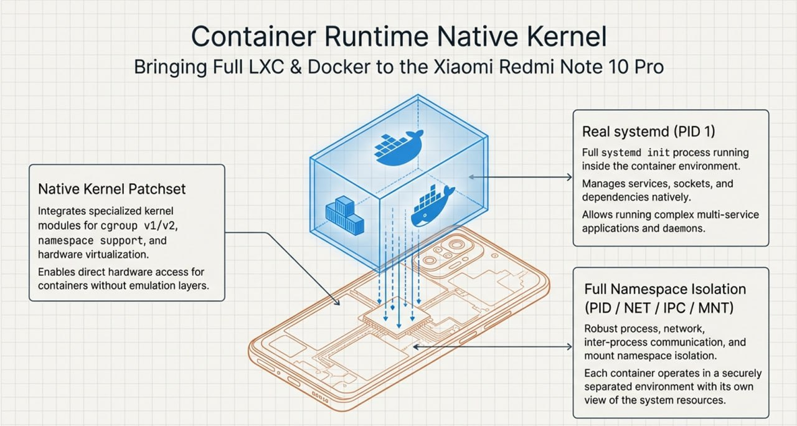
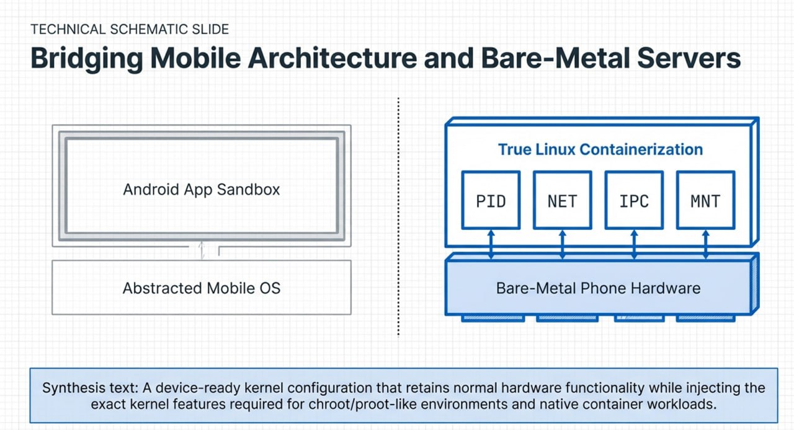
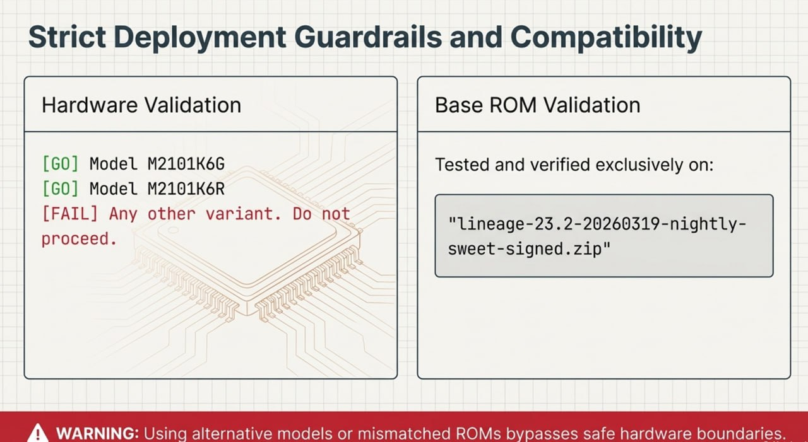
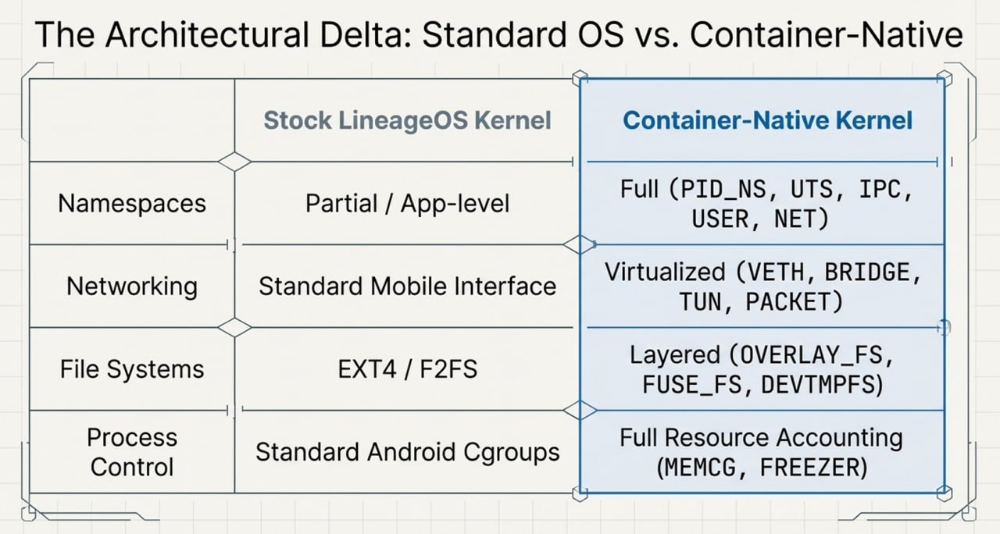
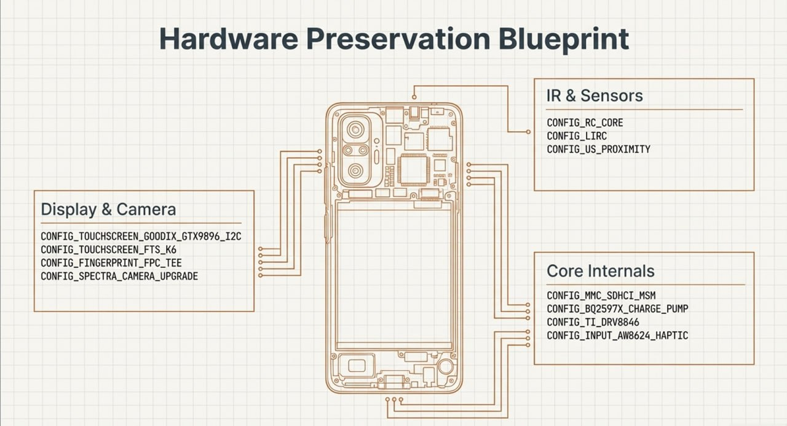
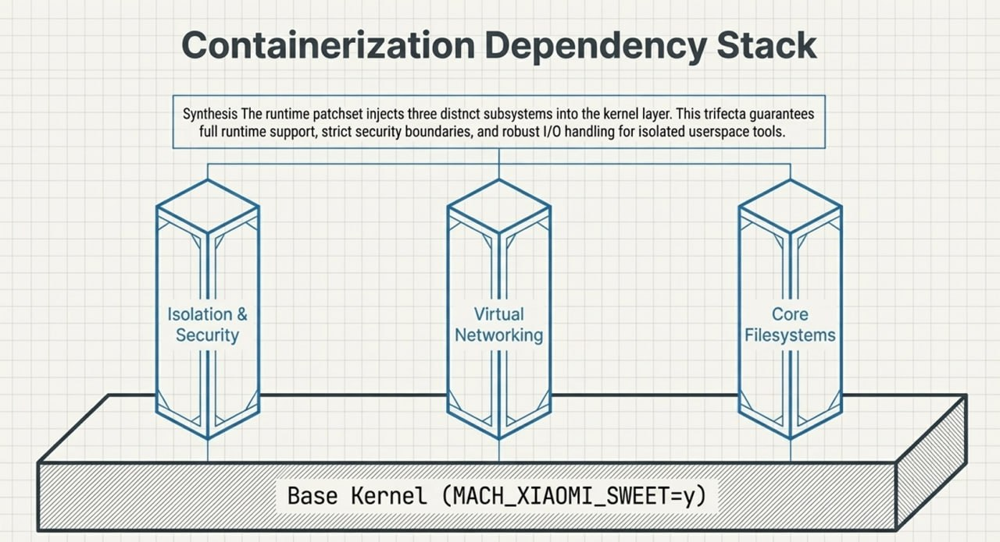
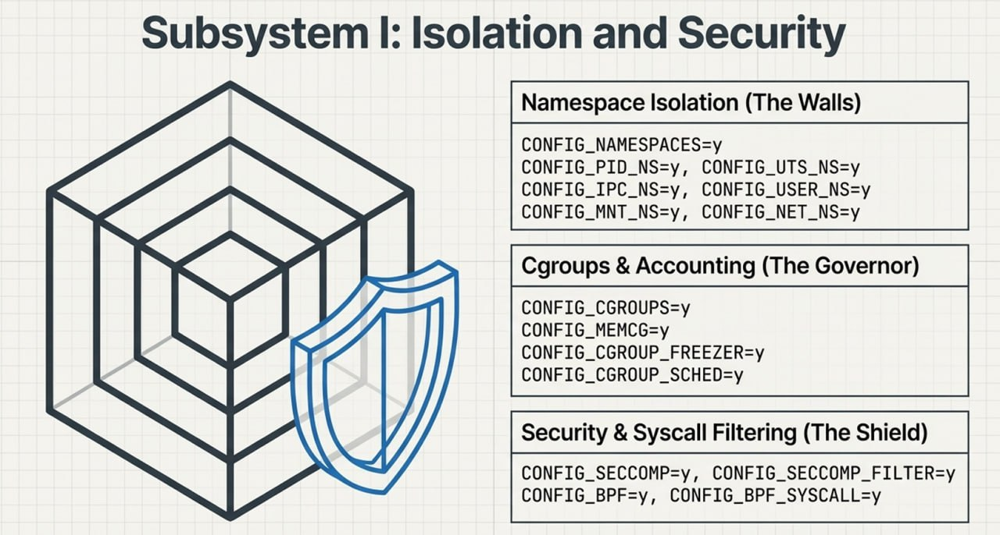
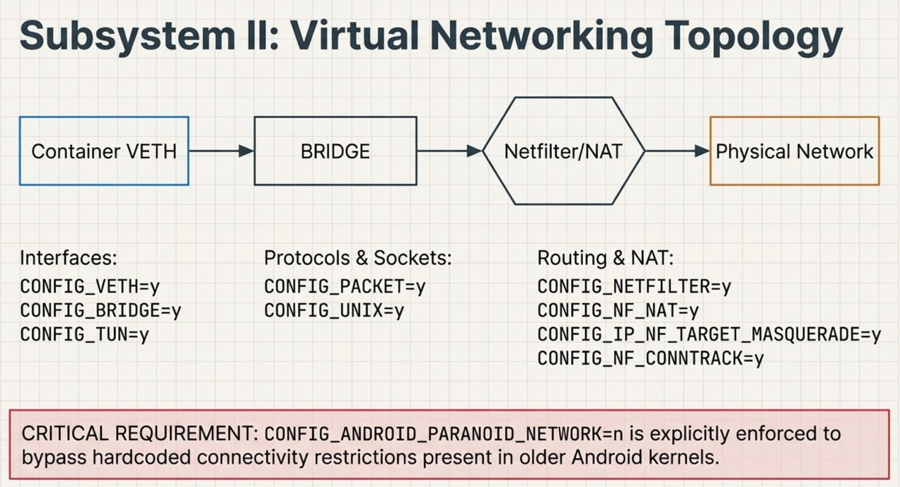
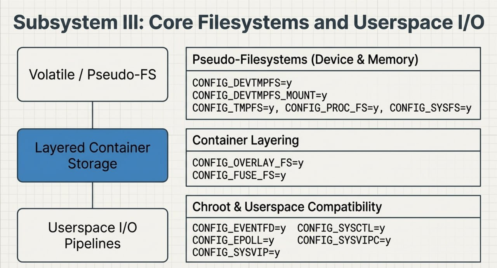
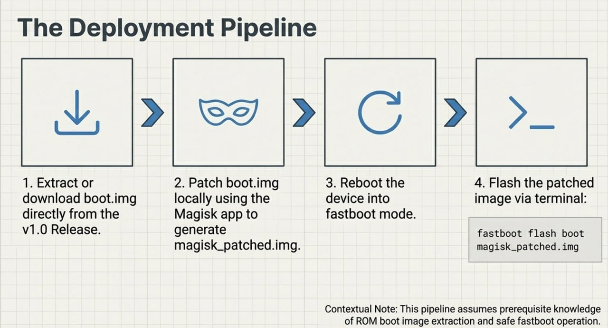

# M2101K6G Container Runtime Native Kernel
# Xiaomi Redmi Note 10 Pro Container Runtime Native Kernel

✅ LXC / Docker  
✅ real systemd (PID 1)  
✅ isolate full namespace (PID / NET / IPC / MNT)

Native kernel patch set for running container/chroot-style workloads on Xiaomi sweet devices with LineageOS 23.2.



---

## Executive Summary

The **M2101K6G Container Runtime Native Kernel** is a specialized patch set designed for the **Xiaomi Redmi Note 10 Pro** (codename **sweet**).

Its primary goal is to enable **native containerization support** while preserving full daily-driver hardware functionality.

By enabling a broad set of kernel features such as:

- namespace isolation
- cgroups
- overlayfs
- advanced networking
- init/systemd compatibility

this kernel allows the device to run more advanced isolated userspace workloads, including:

- **LXC**
- **Docker-style environments**
- **real systemd (PID 1)**
- **chroot / proot-like environments**

This implementation is specifically tailored for **LineageOS 23.2** and should only be used on the exact supported device models listed below.

---

## Supported models

Your device model must match exactly one of these:

- `M2101K6G`
- `M2101K6R`

If your model is different, **do not use this build**.

---

## Base ROM

This setup was tested on:

- `lineage-23.2-20260319-nightly-sweet-signed.zip`
- <https://mirrorbits.lineageos.org/full/sweet/20260319/lineage-23.2-20260319-nightly-sweet-signed.zip>

---

## What this kernel patch set does

This patch set keeps normal device hardware support while adding the missing kernel features needed for:

- container runtime support
- chroot/proot-like environments
- namespace isolation
- cgroups
- veth/bridge networking
- overlay filesystem
- seccomp
- netfilter/NAT
- better compatibility with init systems and isolated userspace

In short: this is a device-ready kernel config with container-oriented native kernel support.

---

## Compatibility and Requirements

### Software environment

The kernel configuration was developed and tested against:

- `lineage-23.2-20260319-nightly-sweet-signed.zip`

### Core functional capabilities

The primary purpose of this kernel patch set is to transform a standard mobile kernel into one capable of supporting advanced container runtimes.

Enabled capabilities include:

- **Container Runtime Support**: full compatibility for LXC and Docker-style workloads
- **Init System Compatibility**: support for real `systemd` as PID 1
- **Isolation Mechanisms**: full namespace isolation including `PID`, `NET`, `IPC`, and `MNT`
- **Environment Support**: enhanced support for `chroot` and `proot`-like environments

---

## Hardware Support Integrity

A critical part of this patch set is preserving standard device hardware functionality after patching.

### Supported hardware areas

- **Media & Input**: Camera, Touchscreen, Haptics, Step motor
- **Sensors**: Compass, Ultrasound proximity, Fingerprint (FPC / FS TEE)
- **Connectivity**: NFC, IR (LIRC/SPI), MMC / storage stack
- **Power**: Charging and power-management related support

---

## Root / patched boot image

### Deployment methodology

The patched kernel follows the standard Android Magisk-based workflow:

1. Download the correct `boot.img` from - [Releases](https://github.com/IoT-VN/M2101K6G-container-runtime-native-kernel/releases/tag/v1.0)
2. Open **Magisk** and patch that `boot.img`.
3. Magisk will generate a patched image, usually named:
   - `magisk_patched.img`
4. Reboot the phone into **fastboot** mode.
5. Flash the patched boot image:

```bash
fastboot flash boot magisk_patched.img
```

---

## Release notes

### Device / hardware support kept

The following hardware-related configs are enabled or preserved:

- Camera
- Compass
- Fingerprint
- Haptics
- IR
- MMC / storage stack
- NFC
- Power / charging
- Step motor
- Touchscreen
- Ultrasound proximity

### Critical container/runtime fixes added

The important runtime-oriented additions include:

- Namespaces (`PID`, `UTS`, `IPC`, `USER`, `MNT`, `NET`)
- Cgroups and process/resource accounting
- OverlayFS and FUSE
- Seccomp and syscall filtering
- VETH and Bridge networking
- Netfilter / NAT / MASQUERADE / TCPMSS
- Conntrack and IPv4 NAT compatibility
- devtmpfs / devpts / tmpfs / proc / sysfs
- BPF / tun / packet / unix sockets
- IPC features required by isolated userspace tools

---

## Patched config summary

### General / device

```config
CONFIG_ANDROID_PARANOID_NETWORK=n
CONFIG_MACH_XIAOMI_SWEET=y
CONFIG_CMDLINE="cgroup_disable=pressure ramoops_memreserve=4M"
```

### Camera

```config
CONFIG_LDO_WL2866D=y
CONFIG_SPECTRA_CAMERA_UPGRADE=y
```

### Compass

```config
CONFIG_AKM09970=y
```

### Fingerprint

```config
CONFIG_INPUT_FINGERPRINT=y
CONFIG_FINGERPRINT_FPC_TEE=y
CONFIG_FINGERPRINT_FS_TEE=y
```

### Haptics

```config
CONFIG_INPUT_AW8624_HAPTIC=y
# CONFIG_LEDS_QPNP_HAPTICS is not set
# CONFIG_LEDS_QPNP_VIBRATOR_LDO is not set
```

### IR

```config
CONFIG_RC_CORE=y
CONFIG_LIRC=y
CONFIG_RC_DEVICES=y
CONFIG_IR_SPI=y
```

### MMC / storage

```config
CONFIG_MMC=y
CONFIG_MMC_PERF_PROFILING=y
CONFIG_MMC_BLOCK_MINORS=32
CONFIG_MMC_BLOCK_DEFERRED_RESUME=y
CONFIG_MMC_TEST=m
CONFIG_MMC_PARANOID_SD_INIT=y
CONFIG_MMC_CLKGATE=y
CONFIG_MMC_SDHCI=y
CONFIG_MMC_SDHCI_PLTFM=y
CONFIG_MMC_SDHCI_MSM=y
CONFIG_MMC_CQ_HCI=y
CONFIG_MMC_CQ_HCI_CRYPTO=y
CONFIG_MMC_CQ_HCI_CRYPTO_QTI=y
```

### NFC

```config
CONFIG_NFC_NQ_PN80T=y
# CONFIG_NFC_NQ is not set
```

### Power / charging

```config
CONFIG_BATT_VERIFY_BY_DS28E16=y
CONFIG_BQ2597X_CHARGE_PUMP=y
CONFIG_K6_CHARGE=y
CONFIG_ONEWIRE_GPIO=y
# CONFIG_SMB1355_SLAVE_CHARGER is not set
# CONFIG_SMB1390_CHARGE_PUMP_PSY is not set
```

### Step motor

```config
CONFIG_TI_DRV8846=y
```

### Touchscreen

```config
CONFIG_TOUCHSCREEN_GOODIX_GTX9896_I2C=y
CONFIG_TOUCHSCREEN_FTS_K6=y
CONFIG_TOUCHSCREEN_XIAOMI_TOUCHFEATURE=y
CONFIG_NEW_TOUCH_GAMEMODE=y
CONFIG_TOUCHSCREEN_TDDI_DBCLK=y
```

### Ultrasound proximity

```config
CONFIG_US_PROXIMITY=y
```

---

## Technical Kernel Configuration Breakdown

### Namespace and isolation

The kernel implements complete namespace support to ensure isolated environments can operate independently.

```config
CONFIG_NAMESPACES=y
CONFIG_PID_NS=y
CONFIG_UTS_NS=y
CONFIG_IPC_NS=y
CONFIG_USER_NS=y
CONFIG_MNT_NS=y
CONFIG_NET_NS=y
```

Additional security/isolation support:

```config
CONFIG_SECCOMP=y
CONFIG_SECCOMP_FILTER=y
CONFIG_BPF=y
CONFIG_BPF_SYSCALL=y
```

### Resource management (cgroups)

Process and resource accounting are handled through enabled control groups:

```config
CONFIG_CGROUPS=y
CONFIG_CGROUP_DEVICE=y
CONFIG_CGROUP_PIDS=y
CONFIG_MEMCG=y
CONFIG_CGROUP_SCHED=y
CONFIG_FAIR_GROUP_SCHED=y
CONFIG_CFS_BANDWIDTH=y
CONFIG_CGROUP_FREEZER=y
CONFIG_CGROUP_NET_PRIO=y
CONFIG_CGROUP_CPUACCT=y
```

### Filesystems and userspace compatibility

To support container images and isolated userspace tools, the following filesystem features are included:

```config
CONFIG_PROC_FS=y
CONFIG_SYSFS=y
CONFIG_TMPFS=y
CONFIG_TMPFS_POSIX_ACL=y
CONFIG_DEVTMPFS=y
CONFIG_DEVTMPFS_MOUNT=y
CONFIG_DEVPTS_FS=y
CONFIG_DEVPTS_MULTIPLE_INSTANCES=y
CONFIG_OVERLAY_FS=y
CONFIG_FUSE_FS=y
```

### IPC / chroot support

```config
CONFIG_EVENTFD=y
CONFIG_EPOLL=y
CONFIG_SYSCTL=y
CONFIG_SYSVIPC=y
CONFIG_POSIX_MQUEUE=y
```

### Networking and netfilter

The kernel includes a robust networking stack for container communication and NAT.

#### Virtual networking

```config
CONFIG_VETH=y
CONFIG_BRIDGE=y
CONFIG_TUN=y
CONFIG_PACKET=y
CONFIG_UNIX=y
```

#### Netfilter / iptables / NAT

```config
CONFIG_NETFILTER=y
CONFIG_NETFILTER_ADVANCED=y
CONFIG_IP_NF_FILTER=y
CONFIG_NF_NAT=y
CONFIG_NETFILTER_XT_MATCH_ADDRTYPE=y
CONFIG_IP_NF_TARGET_MASQUERADE=y
CONFIG_NETFILTER_XT_TARGET_MASQUERADE=y
CONFIG_NETFILTER_XT_TARGET_TCPMSS=y
CONFIG_NF_CONNTRACK=y
CONFIG_NF_CONNTRACK_NETLINK=y
CONFIG_NF_NAT_REDIRECT=y
CONFIG_NF_CONNTRACK_IPV4=y
CONFIG_IP_NF_IPTABLES=y
CONFIG_NF_NAT_IPV4=y
CONFIG_IP_NF_NAT=y
CONFIG_IP_ADVANCED_ROUTER=y
CONFIG_IP_MULTIPLE_TABLES=y
CONFIG_NETFILTER_XTABLES=y
```

### Firmware / debug support

```config
CONFIG_FW_LOADER=y
CONFIG_FW_LOADER_USER_HELPER=y
CONFIG_FW_LOADER_COMPRESS=y
CONFIG_IKCONFIG=y
CONFIG_IKCONFIG_PROC=y
```

---

## Config flags worth noting

| Config Flag | Value | Rationale |
|---|---|---|
| `CONFIG_ANDROID_PARANOID_NETWORK` | `n` | Disabled to avoid connectivity issues on older kernels |
| `CONFIG_CMDLINE` | `cgroup_disable=pressure ramoops_memreserve=4M` | Specific boot parameters for resource management and memory |
| `CONFIG_IKCONFIG` | `y` | Exposes kernel configuration via `/proc` |

---

## Notes

- `CONFIG_ANDROID_PARANOID_NETWORK=n` is included to avoid connectivity issues on older kernels.
- This project assumes anh already knows how to unpack ROM boot images and use fastboot safely.

---

## Critical risks and warnings

Flashing a modified kernel carries inherent risks.

Deviation from the specified models or ROM versions may result in:

- system bootloops
- hardware regressions
- broken radio/network behavior
- loss of recovery access
- loss of root state

Before flashing, verify:

- device model
- ROM version
- integrity of the source `boot.img`
- integrity of the patched `magisk_patched.img`

Use at your own risk.

---

## Screenshots










